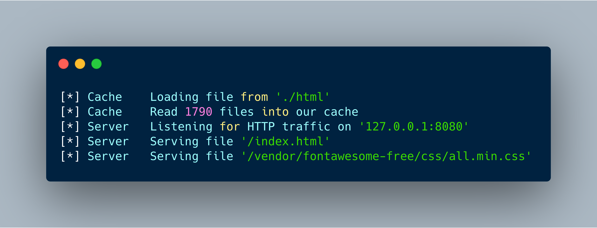

#Basic HTTP Server

This is a basic file serving HTTP serving application written in rust using asyn-std. 
The basic premise of the app is around mapping a directory and serving on specific port.

The application will cache the directory into a concurrent hashmap which will save disk
I/O times and hopefully serve data faster. Note there are no checks for file size so serving
big files may cause memory issues.

The app is configured using the `config.json` file which is placed along side the binary. 
A sample config file would look like this:

```$json
{
  "http_port": 8080, // This is the port to serve the directory on
  "https_port": 0, // Not currently used however will specify the https port to serve on

  "serve_root": "./html" // This is the path to the directory to serve
}
```

## How To Use

Don't use for anything other than testing. This app requires cargo to be installed then is run with `cargo run`

## Example output

